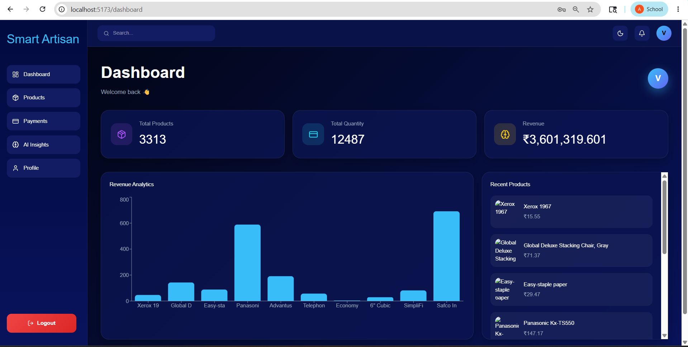
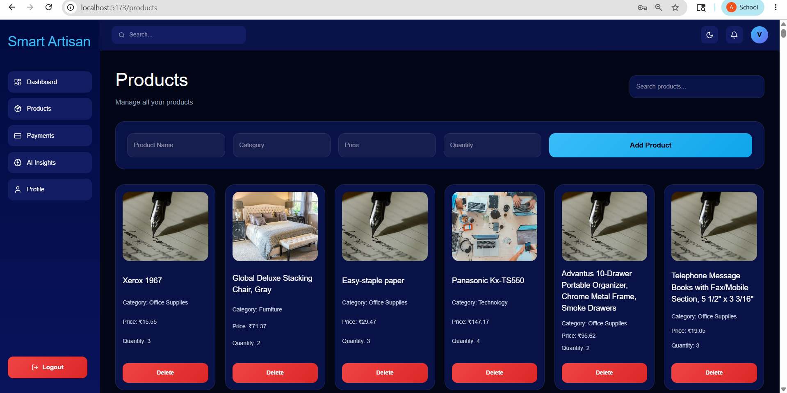
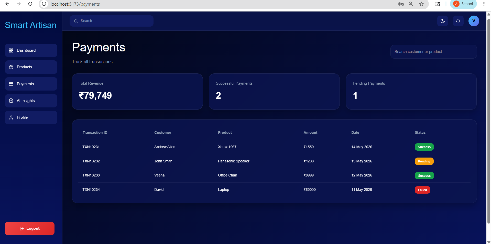
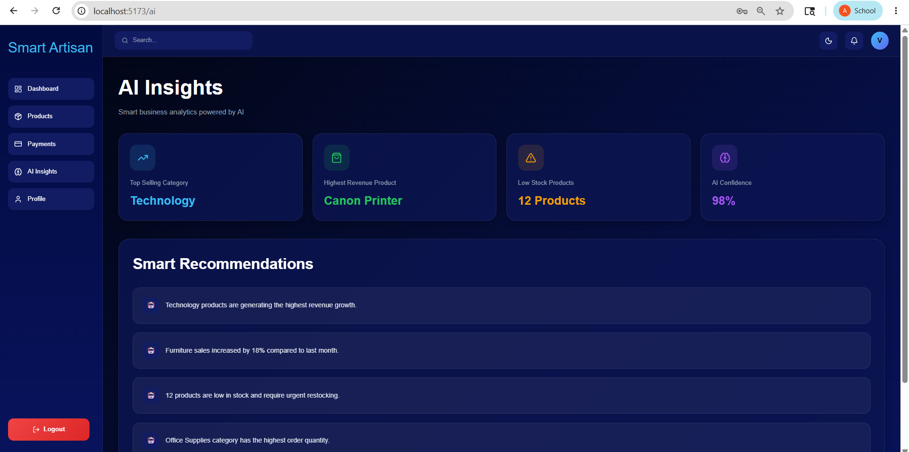
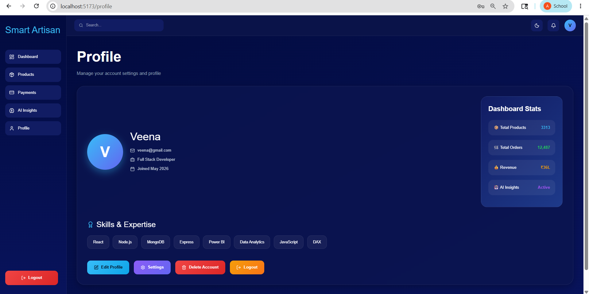

# 🚀 Smart Artisan Assistant

A modern MERN Stack business dashboard built using:

- MongoDB
- Express.js
- React.js
- Node.js

This project includes:

## ✨ Features

- 📊 Interactive Dashboard
- 📦 Product Management
- 💳 Payments Analytics
- 🤖 AI Insights
- 👤 Professional Profile Page
- 🔐 Authentication System
- 📈 Revenue Analytics
- 🌙 Modern Glassmorphism UI

---

# 📸 Screenshots

## Dashboard


## Products Page


## Payments Page


## AI Insights


## Profile Page


---

# 🛠️ Tech Stack

### Frontend
- React.js
- React Router
- Axios
- Recharts
- Lucide React

### Backend
- Node.js
- Express.js
- MongoDB
- Mongoose

---

# ⚙️ Installation

## Clone Repository

```bash
git clone https://github.com/Bhavani-2005/MERN-PROJECT.git
```

## Backend Setup

```bash
cd backend
npm install
npm start
```

## Frontend Setup

```bash
cd frontend
npm install
npm run dev
```

---

# 🌐 Environment Variables

Create `.env` file inside backend:

```env
MONGO_URI=your_mongodb_connection
JWT_SECRET=your_secret_key
```

---

# 📌 Future Improvements

- Live Payment Gateway
- AI Prediction System
- Product Image Upload
- Admin/User Roles
- Cloud Deployment
- Real-Time Analytics

---
